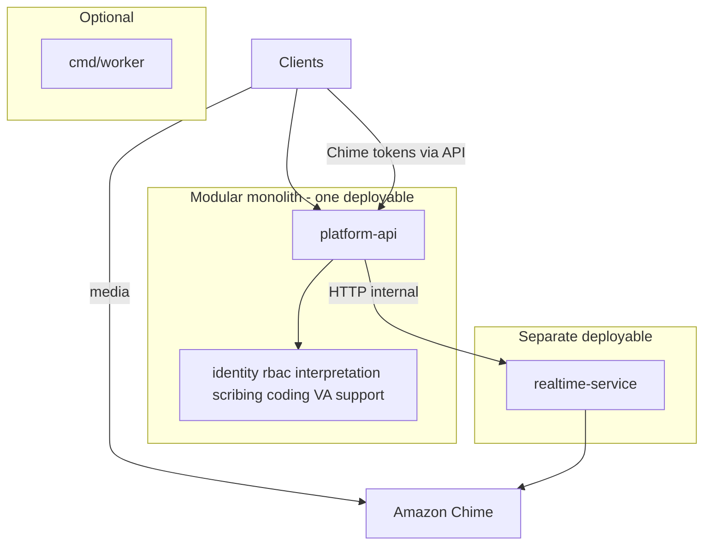
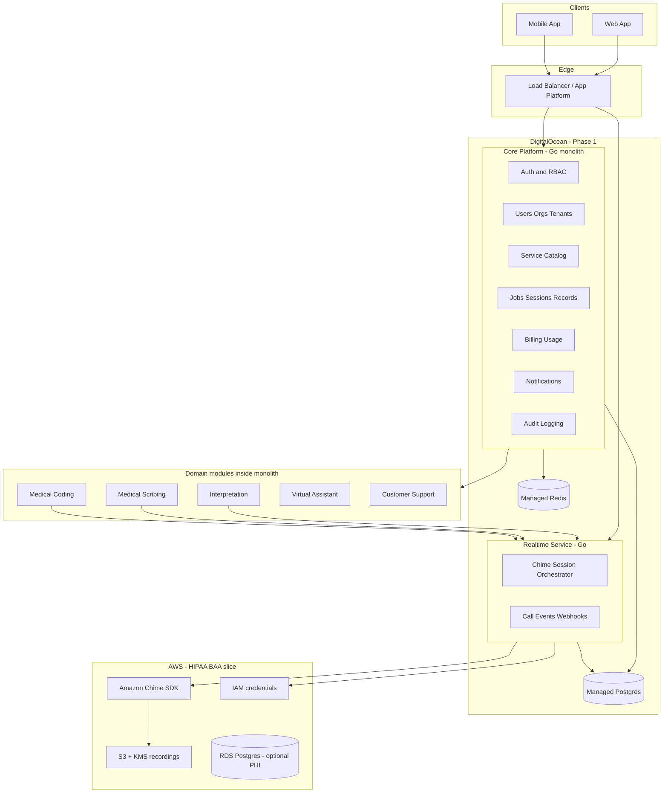
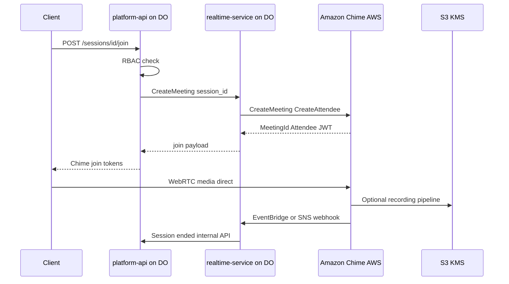
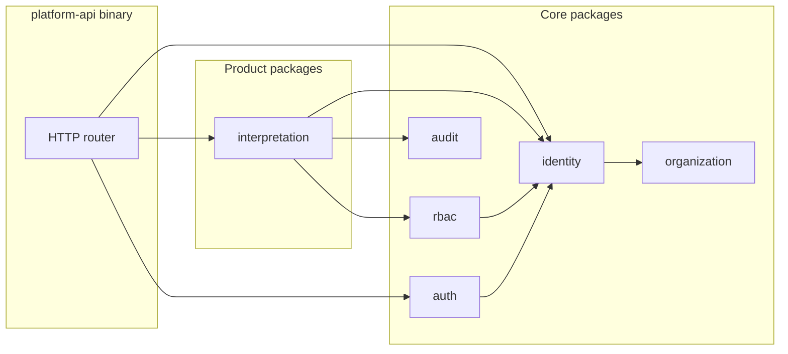
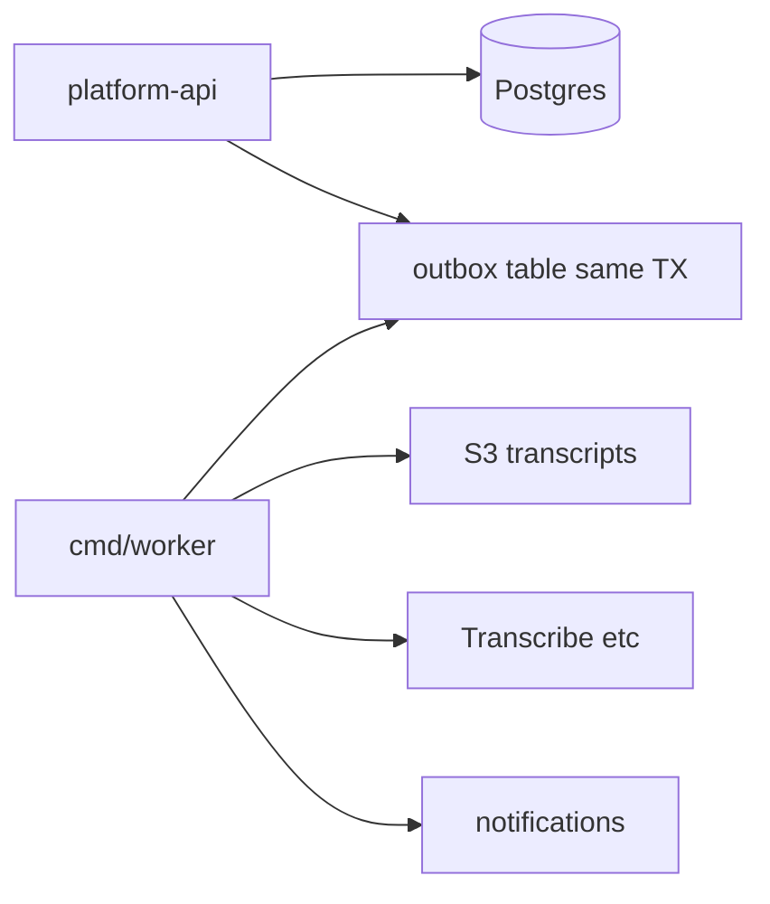

# SpeechResolve — Backend Architecture Plan (Reference)

> Saved for reference. Source: architecture planning sessions.
> Full Cursor plan copy; YAML frontmatter removed.


# SpeechResolve Golang Backend — Architecture Feedback

## Executive recommendation

**Start with a modular monolith + one dedicated realtime service**, not five microservices on day one.

#### Is this a monolith?

| Deployable | Pattern | What it is |
|------------|---------|------------|
| **`platform-api`** (+ optional **`worker`**) | **Modular monolith** | **One binary / one process** for almost all business logic (identity, RBAC, interpretation, scribing, coding, VA, support). Multiple **Go packages**, one **database**, one deployment unit. |
| **`realtime-service`** | **Separate service** (not part of the monolith) | **Second binary** — only Chime orchestration, webhooks, call↔session linkage. This is **not** a second copy of the whole app. |
| **Five product lines** | **Modules inside the monolith** | Not five microservices — five **packages** inside `platform-api`. |

So: **you do not have a pure single-service monolith.** You have a **modular monolith + realtime microservice** (sometimes called **“monolith-first”** or **two-service architecture**). That matches your plan to separate video/audio (Chime) without splitting Interpretation / Scribing / Coding into separate deployables.



#### Can `platform-api` be split into microservices later?

**Yes.** The modular monolith is a **stepping stone**, not a dead end — if you keep boundaries clean now.

| Makes later split easier | Makes later split painful |
|--------------------------|---------------------------|
| Clear packages (`identity`, `rbac`, `interpretation`, …) | One god `platform` package, cross-imports everywhere |
| **Interfaces** between modules (ports) | Scribing SQL joining coding tables directly |
| Pass **IDs** across modules, not shared ORM structs | Single giant `models` package |
| **Outbox / events** for cross-domain side effects | Every flow needs one big multi-table DB transaction |
| **OpenAPI** grouped by domain (even on one server) | Hidden in-process calls with no contract |
| Postgres **schemas** per domain (`identity`, `scribing`, …) | One flat schema with FKs tying everything together |

**Typical extraction order (lowest risk first):**

1. **`customersupport`** or **`virtualassistant`**
2. **`interpretation`**
3. **`scribing`** / **`coding`** (harder — shared clinical session/artifact concepts)
4. **`identity` + `auth` + `organization` + `rbac`** — keep as one **Platform/Identity** service others call, not four tiny services

**Strangler pattern:** API gateway routes `/api/v1/support/*` to new service → move schema → replace in-process calls with HTTP/gRPC + async events (SQS/NATS/outbox). **`realtime-service` stays separate** throughout.

**Trade-off after split:** lose easy cross-domain ACID transactions; gain independent deploy/scale. Only split when a **team**, **scale**, or **SLA** justifies the ops cost.

Your five business offerings share the same users, roles, billing, notifications, and audit requirements; splitting them into separate deployables early adds network complexity, distributed transactions, and HIPAA surface area without payoff until teams or scale force it.



**Phase 1 hosting:** application containers on **DigitalOcean**; **Amazon Chime** (and optionally **S3/KMS** for recordings) in a small **AWS account** under BAA. **Phase 2:** move `platform-api`, `realtime-service`, Postgres, and Redis to AWS (ECS/EKS + RDS) with minimal application changes if portability rules below are followed.

---

## 0. DigitalOcean now + AWS Chime later (your plan)

This is a **valid and common** cost/control strategy. Treat it as a **hybrid cloud** architecture, not “AWS later means ignore AWS now.”

| Layer | Phase 1 (now) | Phase 2 (contracts) |
|-------|---------------|---------------------|
| **Compute** | DO App Platform or Droplets + Docker | ECS Fargate or EKS |
| **App DB / cache** | DO Managed Postgres + Redis | RDS + ElastiCache |
| **Realtime media** | Amazon Chime SDK (AWS) | Same |
| **Recordings / artifacts** | **AWS S3 + KMS** (recommended even on DO) | Same |
| **Secrets** | DO App Platform secrets / Vault | AWS Secrets Manager |
| **Auth** | Auth0 / Keycloak on DO, or Cognito on AWS | Often Cognito once on AWS |

### Critical HIPAA note (read before storing PHI on DO)

**DigitalOcean does not offer a HIPAA BAA** for their platform the way AWS does. Because you chose HIPAA/PHI from day one:

- **Do not store PHI** (patient names, clinical notes, full transcripts) on DO Managed Postgres, DO Spaces, or DO backups unless legal/compliance explicitly accepts a non-BAA processor for a limited pilot.
- **Pragmatic hybrid (recommended):** run **stateless Go APIs on DO**; keep **PHI in AWS** (RDS Postgres + S3) from the start. Chime already lives in AWS. One BAA, one compliance boundary for data.
- **Alternative for true MVP:** synthetic/demo data only on DO until AWS migration — only if contracts and legal agree.

Chime orchestration from DO is fine: the **realtime-service** calls AWS APIs over HTTPS with IAM keys; media never transits your DO servers.

### Cross-cloud integration (DO app ↔ AWS Chime)



**Implementation details:**

1. **IAM:** Create a dedicated IAM user or role (minimal policy: Chime SDK actions + S3 bucket for pipelines). Store `AWS_ACCESS_KEY_ID` / `AWS_SECRET_ACCESS_KEY` in DO secrets — rotate regularly. Prefer **separate AWS account** for prod Chime vs personal AWS.
2. **Region:** Pick one AWS region (e.g. `us-east-1`) for Chime + S3; keep DO app in a nearby DO region (NYC ↔ us-east-1) to limit API latency.
3. **Webhooks:** Chime events need a **public HTTPS** URL → expose `realtime-service` on DO with valid TLS (App Platform custom domain). Verify webhook signatures if supported.
4. **No VPC peering required** — all integration is public AWS APIs + HTTPS webhooks (simpler than many expect).
5. **Client traffic:** Browsers connect **directly to Chime** for media; DO only issues tokens. This keeps DO bandwidth low.

### Migration to AWS (when contracts land)

**No fundamental blocker** if you follow the hybrid/portable design in this plan. Moving DO → AWS is a **planned infra migration**, not a rewrite. Chime and S3 are already on AWS, so realtime media does not move — only **compute**, **DB**, **Redis**, and **log drains** change.

#### What moves without code issues

| Component | Issue risk |
|-----------|------------|
| Go services (`platform-api`, `realtime-service`, `worker`) | **Low** — same Docker images on ECS/Fargate |
| Domain packages, chi, sqlc, business logic | **None** |
| Chime integration | **Low** — already AWS; swap IAM user keys → **task IAM roles** |
| S3 buckets / KMS keys | **Low** — may add VPC endpoint later; URLs stay `s3://` |
| OpenAPI / clients | **None** if base URL unchanged or versioned cutover |

#### What needs careful execution (real “issues”)

| Area | Risk | Mitigation |
|------|------|------------|
| **Postgres cutover** | Downtime or data drift | `pg_dump` / AWS DMS / logical replication; practice on staging; freeze writes during final sync; update `DATABASE_URL`; run migrations on RDS before cutover |
| **DNS / TLS** | Clients hit old DO | Lower TTL (300s) before cutover; parallel run smoke tests; keep DO read-only briefly as rollback |
| **Chime webhooks** | Events lost if URL wrong | Point webhook to `realtime-service` new URL **before** DNS switch; test with Chime sandbox event |
| **IAM credentials** | Leaked/static keys on DO | On AWS use **ECS task roles** for Chime/S3; remove `AWS_ACCESS_KEY_ID` from env |
| **RDS security** | App cannot connect | RDS in private subnets; security group allows **ECS tasks only**; `sslmode=verify-full` with RDS CA |
| **Redis** | Session/cache loss | **Acceptable** if Redis holds only non-PHI cache; warm empty ElastiCache; users re-login if needed |
| **Secrets** | Missed env vars | Inventory DO secrets → **Secrets Manager**; checklist per service |
| **Observability** | Log drain breaks | Re-point to CloudWatch / Grafana; update Sentry environment tags |
| **HIPAA / PHI on DO** | Compliance gap until move | If PHI was on DO Postgres, **migrate PHI to RDS first** or accept no PHI on DO until AWS |
| **Third-party allowlists** | Webhooks/OIDC callbacks | Update Auth0/OIDC redirect URIs, any IP allowlists, Sentry allow domains |
| **Cost / ops** | Surprise AWS bill complexity | Start Fargate + RDS Multi-AZ in one region; IaC (Terraform) from day one on AWS side |

#### What does NOT break

- Meeting IDs, session records, user UUIDs in DB (unchanged after DB restore)
- Mobile/web apps (only API base URL if hostname changes)
- Encryption model (TLS + RDS KMS + S3 SSE-KMS — stronger on full AWS)

#### Recommended cutover pattern

1. Provision AWS (VPC, RDS, ECS, ElastiCache, Secrets Manager) via Terraform.
2. Restore DB replica or dump → RDS; run **goose** migrations.
3. Deploy same images to ECS; internal ALB health checks green.
4. Dual-write **not** required for MVP — use **maintenance window** (30–60 min) for final DB sync + DNS flip.
5. Update Chime webhook URL → smoke test call → switch `api.speechresolve.com` DNS.
6. Monitor 48h; decommission DO apps and DO Postgres after backup retention.

#### Design choices that prevent migration pain (do now)

- Config via **environment variables** only (no DO metadata API in app code).
- **No DO Spaces** for PHI files — S3 from day one.
- **Storage and queue interfaces** in Go (`S3Store`, `JobEnqueuer`).
- **Single AWS region** for Chime, S3, and later RDS (e.g. `us-east-1`).
- Document all secrets and webhook URLs in a runbook.

| Portable from day one | Swap at migration |
|----------------------|-------------------|
| Go binaries in Docker | DO App Platform → ECS task definitions |
| Env vars: `DATABASE_URL`, `AWS_REGION`, `S3_BUCKET` | Point `DATABASE_URL` to RDS; use IAM roles instead of static keys |
| `internal/shared/storage` interface (`S3Store`, `Postgres`) | Same code, new endpoints |
| OpenAPI contracts, domain packages | Unchanged |
| Chime meeting IDs in DB | Unchanged |

**Avoid on DO:** DO-specific APIs in application code; hardcoded DO Spaces URLs; coupling auth to DO-only features without abstraction.

---

## 1. Service boundaries (what to split vs keep together)

| Deployable | Responsibility | Why separate |
|------------|----------------|--------------|
| **platform-api** (monolith) | Auth, RBAC, orgs, users, service catalog, job/session metadata, documents, coding/scribing workflows, support tickets, admin APIs | Shared domain; one transaction boundary for “create session + assign provider” |
| **realtime-service** | Chime meeting creation, attendee tokens, call lifecycle, webhooks from Chime, link call to `session_id` | Different scaling profile, credentials, and failure modes; can restart without touching billing |
| **Workers** (optional phase 2) | Async: transcription export, coding suggestions, email, report generation | CPU/long-running jobs off request path |

**Do not** create separate microservices per product line (Interpretation vs Scribing vs Coding) until you have clear team ownership and independent release cadences. Instead, use **Go packages as bounded contexts** inside one repo:

```
speechresolve/
├── cmd/
│   ├── platform-api/
│   └── realtime-service/
├── internal/
│   ├── identity/          # users, profiles, memberships (bounded context)
│   ├── auth/              # sessions, JWT, OIDC callbacks
│   ├── organization/      # tenants, org settings
│   ├── rbac/              # roles, permissions, policy checks
│   ├── audit/             # append-only audit events
│   ├── interpretation/
│   ├── scribing/
│   ├── coding/
│   ├── virtualassistant/
│   ├── customersupport/
│   └── shared/            # db, events, httpx, errors (no domain logic)
├── pkg/                   # only if truly reusable externally
├── migrations/
├── deploy/
│   ├── docker/
│   └── compose/
└── api/openapi/           # or protobuf
```

Each domain module exposes: `handler` → `service` → `repository` (hexagonal / ports-and-adapters). Cross-module calls use **small interfaces** defined by the consumer (Go idiom) or a thin `internal/ports/` package — not a fat `platform` god-module. Product modules (e.g. scribing) depend on **`rbac` + `identity` interfaces**, not on scribing querying the users table directly.

### 1.1 Should users be separate from the platform module?

**Yes — separate `identity` (users) from a catch-all `platform` package.** Do **not** deploy users as a separate microservice yet.

| Package | Owns | Does not own |
|---------|------|----------------|
| **`identity`** | User record, profile, status, provider/client metadata, **membership** (user ↔ org) | Permission checks, token issuance |
| **`auth`** | Login, refresh tokens, OIDC, MFA hooks | User profile fields |
| **`organization`** | Org/tenant, org settings, billing account link | User credentials |
| **`rbac`** | Roles, `resource:action` permissions, `Can(user, action, resource)` | User CRUD |
| **`audit`** | Immutable access/event log | Business workflows |
| **`shared`** | DB pool, HTTP middleware, logging, outbox | Domain rules |

**Why split users out of `platform`:**

- **Clear ownership** — “invite user” and “change provider license” live in `identity`; “can this user join session?” lives in `rbac`.
- **Avoid a god package** — `platform` tends to accumulate everything and becomes hard to test and import-cycle prone.
- **Product modules stay clean** — interpretation imports `identity.UserID` + `rbac.Enforcer`, not all of auth/org/users.
- **Same database** — packages are logical boundaries; one Postgres DB, FKs allowed across schemas/tables.

**What `platform-api` means:** the **deployable binary name**, not a Go package. The HTTP router in `cmd/platform-api` wires handlers from `identity`, `auth`, `organization`, `rbac`, and product modules.

**Keep in one transaction when needed:** e.g. “create org + admin user” orchestrates `organization` + `identity` + `rbac` from an **application service** in `cmd/platform-api` or a thin `internal/onboarding/` package — still one DB transaction, no HTTP between modules.

**Optional later:** `internal/identity/provider/` subpackage for provider-specific fields (languages, certifications) so client user types do not bloat the core user model.



**Import rules (enforce with discipline or `go-arch-lint`):**

- `identity` must not import `interpretation`, `scribing`, etc.
- Product modules may import `identity`, `rbac`, `audit`, `shared`
- `shared` must not import any `internal/*` domain package

---

## 2. Amazon Chime as the realtime layer (good fit for HIPAA)

Choosing **Amazon Chime SDK** aligns with HIPAA when you operate under an **AWS BAA** and use eligible services in eligible regions. Your **realtime-service** should not reimplement WebRTC media; it should **orchestrate**:

1. Client requests join → platform validates RBAC + session state.
2. Realtime-service calls Chime SDK: `CreateMeeting`, `CreateAttendee` (or equivalent APIs in your SDK version).
3. Return **short-lived join tokens** to client; never log raw tokens in application logs.
4. Persist **meeting_id**, **attendee_id**, **session_id**, start/end, participants (IDs only, minimal PHI in realtime DB).
5. Subscribe to **Chime event callbacks** (meeting started/ended, attendee joined) → update session state + audit log.

**Shared by Interpretation, Scribing, Coding:** one realtime service with a `session_type` or `product` field. Scribing may need **recording** and **media pipelines** (Chime media pipelines → S3 with KMS) — configure per session type in orchestration, not separate Chime stacks.

**Virtual Assistant & Customer Support:** if they need voice/chat only later, same service can add Chime messaging or a second channel; avoid a second media stack until requirements differ (e.g. PSTN).

---

## 3. Roles and authorization (5 roles)

Treat roles as **RBAC + scope**, not five hardcoded `if` branches.

| Role | Typical scope |
|------|----------------|
| **client** | Own org’s sessions, requests, documents |
| **provider** | Assigned sessions, clinical/workspace tools per product |
| **manager** | Team/org operations, scheduling, reports (no super-admin config) |
| **admin** | Org-level settings, users, billing view |
| **super_admin** | Platform-wide tenants, feature flags, support impersonation (strictly audited) |

**Recommendations:**

- Store permissions as **`resource:action`** (e.g. `session:create`, `session:join`, `coding:approve`, `org:user:invite`).
- Map roles → permission sets in DB (configurable per tenant for enterprise).
- Enforce at **HTTP middleware** and again in **service layer** (never trust handler-only checks).
- Use **organization_id** on every row; all queries scoped by tenant.
- **super_admin** actions: break-glass pattern, MFA, immutable audit trail.

Libraries: [Casbin](https://github.com/casbin/casbin) with a Golang adapter, or a small custom policy table — Casbin pays off if rules get complex (manager vs admin overlap).

---

## 4. HIPAA-first platform concerns (non-negotiable from day one)

Because you selected HIPAA/PHI:

| Area | Practice |
|------|----------|
| **AWS** | Sign BAA **now** (even for Chime-only); use HIPAA-eligible services only; CloudTrail on Chime/S3/RDS accounts |
| **DigitalOcean** | **No BAA** — do not treat DO as PHI store; APIs/stateless OK; prefer AWS RDS for PHI (hybrid) |
| **Data** | Encrypted Postgres (AWS RDS preferred for PHI); S3 SSE-KMS for recordings; no PHI in DO logs/metrics |
| **Transit** | TLS everywhere; mTLS service-to-service if split deployables |
| **Audit** | Append-only audit log: who accessed which patient/session/document, when, from where |
| **Retention** | Defined policies per artifact (recordings, transcripts, coding outputs) |
| **Auth** | OIDC/Cognito or similar; short JWT access + refresh; rotate keys via KMS |
| **Minimum necessary** | Realtime service stores meeting metadata, not clinical narrative |
| **BAAs** | Chime, Transcribe, Comprehend Medical, etc. only after vendor BAA — document in compliance packet |

### 4.1 Encryption — what to use (HIPAA-aligned)

Use **industry-standard algorithms only**; do not invent custom crypto. Prefer **platform-managed encryption** where possible; add **application-layer encryption** only for the highest-sensitivity fields.

#### In transit (always on)

| Path | Encryption | Notes |
|------|------------|--------|
| Browser / mobile → APIs | **TLS 1.2+** (prefer **1.3**) | Terminate at DO load balancer / App Platform; valid public certs |
| Service → service (platform ↔ realtime) | **HTTPS** on private URL or mTLS if on private network | Same TLS 1.2+; optional mTLS later on AWS VPC |
| App → Postgres | **TLS to DB** | `sslmode=verify-full` for AWS RDS; require SSL on DO Managed Postgres |
| App → Redis | **TLS** | Enable on DO Managed Redis / ElastiCache in-transit encryption |
| App → AWS (Chime, S3, KMS) | **HTTPS** (SDK default) | IAM SigV4 over TLS |
| Call media | **Chime / WebRTC (SRTP)** | Handled by Amazon Chime SDK — not your responsibility to configure |

#### At rest (storage)

| Data | Encryption | Recommendation |
|------|------------|----------------|
| **PostgreSQL (PHI)** | **AES-256** at rest | **AWS RDS** with **encryption at rest enabled** + **AWS KMS CMK** (customer-managed key). Avoid DO Postgres for PHI. |
| **DO Postgres (non-PHI / dev only)** | Provider disk encryption | DO Managed Postgres encrypts volumes at rest; acceptable only for non-PHI per compliance decision |
| **S3 (recordings, documents, exports)** | **SSE-KMS** (`aws:kms`) | Use a **dedicated KMS CMK** per environment (dev/staging/prod); bucket policy denies unencrypted puts |
| **Backups** | Same as source | RDS automated backups inherit RDS encryption; S3 backup buckets SSE-KMS |
| **Redis** | Provider at-rest encryption | DO/AWS managed Redis encryption at rest where available; **do not store PHI in Redis** — cache keys/IDs only |

#### Keys and secrets

| Secret type | Where | Algorithm / method |
|-------------|--------|-------------------|
| **Master keys** | **AWS KMS** (CMK) | AES-256; key rotation enabled (annual automatic + manual on incident) |
| **DB credentials, IAM keys, API keys** | DO App Platform secrets → later **AWS Secrets Manager** | Never in git; rotate IAM keys every 90 days on DO |
| **JWT signing** | Secrets Manager / DO secrets | **RS256** (RSA-2048+) or **ES256** (P-256); short-lived access tokens (15–60 min) |
| **Passwords** (if any local auth) | App | **Argon2id** (preferred) or **bcrypt** cost ≥ 12; better: **OIDC only**, no passwords |
| **Refresh tokens** | DB hashed | Store **hash only** (SHA-256 of random token), not plaintext |

#### Application-level (optional, selective)

Use only when a column is especially sensitive (e.g. national ID, free-text clinical note) and you want defense in depth:

- **Algorithm:** **AES-256-GCM** (authenticated encryption)
- **Pattern:** **Envelope encryption** — data key per object/row, encrypted with **KMS Encrypt/Decrypt**; store `{ciphertext, encrypted_data_key, iv, key_id}` in Postgres
- **Go:** `crypto/aes` + `cipher.NewGCM`, or **[AWS Encryption SDK for Go](https://docs.aws.amazon.com/encryption-sdk/latest/developer-guide/go.html)** for less foot-gun surface
- **Do not** use ECB, CBC without careful IV handling, or home-grown key derivation — use **KMS** or **HKDF** from a KMS-derived secret

Most session metadata, assignments, and IDs do **not** need field-level encryption if the database and disk are already KMS-encrypted and access is RBAC-controlled.

#### What Chime / AWS already encrypts

- **Meeting media:** encrypted in transit by Chime (SRTP/DTLS path per AWS docs)
- **Recordings to S3:** configure Chime **media capture pipeline** → S3 with **SSE-KMS** on the destination bucket
- **Transcribe / other AI:** inputs/outputs in S3 with SSE-KMS; call APIs only over TLS from your workers

#### Practical defaults checklist (Phase 1)

1. **TLS 1.2+** on all public endpoints (DO managed certs).
2. **RDS Postgres:** encryption at rest + **KMS CMK** + connections **`sslmode=verify-full`**.
3. **S3:** **SSE-KMS** with CMK; block public access; versioning + lifecycle for retention.
4. **KMS CMK** per environment; IAM least privilege (`kms:Decrypt` only for app role).
5. **No PHI** in logs, Redis, JWT payloads, or error messages.
6. **OIDC** for user auth; JWT signed with **RS256/ES256**.
7. Field-level **AES-256-GCM + KMS** only if compliance or customer contract requires it beyond disk encryption.

#### Do not use

- MD5, SHA-1 alone for security, DES, 3DES, RC4, custom ciphers
- **SSE-S3 only** for HIPAA-sensitive buckets when you need key audit trail — prefer **SSE-KMS**
- Storing Chime join tokens or AWS keys in the database unencrypted
- Rolling your own **key wrapping** without KMS or a vetted library (AWS Encryption SDK)

### 4.2 Logs, errors, and monitoring (Sentry vs alternatives)

Treat **three channels** separately — do not conflate them:

| Channel | Purpose | Storage | HIPAA note |
|---------|---------|---------|------------|
| **Application logs** | Debug/ops: request timing, errors, deploy issues | Log aggregator | **No PHI**; structured JSON only |
| **Error tracking** | Grouped exceptions, stack traces, release health | Sentry / similar | BAA + scrubbing required if any PHI might leak |
| **Audit log** | Compliance: who accessed what | Postgres `audit_events` (append-only) | May reference resource IDs, not clinical text in log line |

#### Recommended stack (Phase 1 — pragmatic)

| Layer | Tool | Why |
|-------|------|-----|
| **Logging in Go** | **`log/slog`** (stdlib) or **zerolog** | Structured JSON: `level`, `msg`, `request_id`, `org_id`, `user_id`, `service` |
| **Log shipping** | **Grafana Cloud (Loki)** or **Axiom** or **Better Stack** | Works from DO; good search; sign BAA if vendor offers it for your tier |
| **Errors (optional but useful)** | **Sentry** (Go SDK) | Best-in-class grouping; use only with strict scrubbing |
| **Metrics** | **Prometheus** scrape or **Grafana Cloud** | RPS, latency, Chime API failures |
| **Traces (Phase 2)** | **OpenTelemetry** → Grafana Tempo or AWS X-Ray after AWS move | Distributed: platform-api ↔ realtime-service |

**AWS CloudWatch Logs** is a strong choice once you are mostly on AWS (under BAA). On **DigitalOcean**, ship stdout JSON to a vendor (Loki/Axiom) rather than building log infra on Droplets.

#### Should you use Sentry?

**Use Sentry for error tracking, not as your primary log system.**

| Use Sentry | Skip Sentry (logs only) |
|------------|-------------------------|
| You want grouped errors, release tracking, alerts in Slack | Very early MVP, tight budget |
| Team is small and needs fast signal on panics | You enforce strict “no PHI ever in errors” and Grafana alerts on `level=error` are enough |

If you use Sentry under HIPAA:

1. **Sentry Business (or higher) + sign their BAA** — required if payloads could contain PHI.
2. **`BeforeSend` / scrubbing** — strip request body, headers (`Authorization`, cookies), query strings; never attach user names, MRNs, transcript snippets.
3. **Send only safe context:** `user_id` (UUID), `org_id`, `session_id`, `request_id` — not email/name/PHI.
4. **Disable default PII** and session replay (N/A for Go backend anyway).
5. **Regional project** if Sentry offers EU/US choice matching your compliance stance.

Sentry complements logs; it does **not** replace **audit** (keep audit in your DB).

#### “Better than Sentry” depends on the job

| Need | Better fit than Sentry alone |
|------|------------------------------|
| **Centralized logs** | Grafana Loki, Axiom, Datadog Logs, CloudWatch |
| **Full observability (logs + metrics + traces)** | **Datadog** or **Grafana Cloud** (Datadog: BAA on eligible plans; pricier) |
| **AWS-native after migration** | **CloudWatch Logs + X-Ray + Alarm → SNS** — all under AWS BAA |
| **Audit / compliance trail** | Your **`audit` package + Postgres** — not Sentry, not application logs |
| **Security SIEM** | Later: export audit to dedicated tooling |

**Datadog** is “better” as an all-in-one but often **overkill and expensive** for Phase 1. **Grafana Cloud (Loki + Prometheus + optional Tempo)** is a common sweet spot for Go on DO.

#### Go logging rules (HIPAA-safe)

```go
// Good
slog.Info("session created", "session_id", id, "org_id", orgID, "request_id", reqID)

// Bad — never
slog.Info("patient note", "content", clinicalText)
```

- **Middleware:** generate `request_id`; log method, path, status, duration — not bodies.
- **Panic recovery:** log stack server-side; return generic message to client.
- **Chime/AWS errors:** log AWS error code + `meeting_id`, not attendee JWT.
- **Retention:** app logs 30–90 days; **audit** per policy (often years).

#### Phase 1 minimal setup

1. **zerolog or slog** → JSON stdout.
2. **DO log drain** or agent → **Grafana Cloud Loki** (or Axiom).
3. **Sentry** for `platform-api` + `realtime-service` with scrubbing + BAA when handling real PHI.
4. **`audit_events` table** from day one — separate from Loki/Sentry.
5. Alerts: Sentry issue spike + Loki query `level=error` rate + RDS/health checks.

#### Phase 2 (AWS migration)

- Add **CloudWatch** for logs/metrics; keep Grafana or consolidate.
- **OpenTelemetry** exporter to X-Ray or Tempo.
- Re-evaluate Sentry vs CloudWatch anomaly detection based on contract requirements.

**Eventing:** prefer **outbox pattern** (transactional outbox table → worker) over fire-and-forget goroutines for anything that must be auditable (e.g. “session completed” → billing + audit).

---

## 5. Domain model sketch (shared concepts)

Unify cross-product language early to avoid three different “session” models:

- **Organization** → **User** (with roles)
- **ServiceRequest** / **Engagement** — client asks for Interpretation | Scribing | Coding | VA | Support
- **Session** — live or async work unit; links to **ChimeMeeting** when realtime
- **Artifact** — transcript, note, code set, ticket transcript (typed, encrypted at rest)
- **Assignment** — provider(s) + manager visibility

Interpretation/Scribing/Coding modules add **workflow state machines** on top of `Session`. VA/Support may skip Chime initially but reuse `Session` for async threads.

---

## 6. Docker and deployment

**Development:** `docker-compose` with `platform-api`, `realtime-service`, `postgres`, `redis`. **Chime:** dedicated AWS dev account + interface mocks for unit tests (no full local emulator).

**Production Phase 1 — DigitalOcean:**

| Option | Pros | Cons |
|--------|------|------|
| **App Platform** (recommended for small team) | Managed TLS, deploy from GitHub, secrets built-in | Less control than raw VMs |
| **Droplet + Docker Compose** | Cheapest, full control | You manage TLS (Caddy/Traefik), updates, failover |
| **DOKS (Kubernetes)** | Matches future EKS mental model | Heavier ops for early stage |

Suggested starter: **two App Platform services** (`platform-api`, `realtime-service`) + **DO Managed Postgres** + **Managed Redis**, plus **AWS** for Chime + S3. If PHI must be compliant immediately, use **AWS RDS** instead of DO Postgres and allow DO app egress to RDS security group.

**Production Phase 2 — AWS:** same Docker images → ECS Fargate; RDS; ElastiCache; IAM roles for Chime (drop static keys).

```yaml
# docker-compose — local and optional DO Droplet prod
services:
  platform-api:
    build: { target: platform-api }
    env_file: .env
  realtime-service:
    build: { target: realtime-service }
    environment:
      AWS_REGION: us-east-1
      # IAM keys from secrets in prod
  postgres:
    image: postgres:16
  redis:
    image: redis:7
```

Health: `/healthz` (liveness), `/readyz` (DB + **AWS Chime credential** check). Graceful shutdown for in-flight HTTP.

### 6.1 Go HTTP framework vs raw Go; background jobs (not Celery)

#### HTTP layer: raw Go vs framework

**Recommendation: “raw Go” at the core + a small router — not a heavy framework.**

Go culture favors **explicit structure** over Rails/Django-style frameworks. There is no need for a full MVC framework.

| Approach | Verdict |
|----------|---------|
| **`net/http` + Go 1.22+ `ServeMux`** | Viable from scratch in 2025; best if you want zero router deps and a small API surface |
| **[chi](https://github.com/go-chi/chi)** | **Chosen default for SpeechResolve (greenfield)** — see decision below |
| **Echo** | Fine alternative to chi; slightly more bundled |
| **Gin** | Popular but custom context; team must like its style |
| **Fiber** | Fast; **not** `net/http` — avoid unless you have a strong reason |
| **Buffalo / Beego** | Full frameworks — **skip** for a HIPAA API monolith |

**Suggested stack (libraries, not a framework):**

| Concern | Library |
|---------|---------|
| HTTP router | **chi** (or stdlib mux only) |
| Config | **env** / **viper** / `os.Getenv` |
| DB | **pgx** + **sqlc** (type-safe SQL) or **sqlx** |
| Migrations | **goose** or **golang-migrate** |
| Validation | **go-playground/validator** on request DTOs |
| Auth middleware | OIDC JWT (**coreos/go-oidc** + **lestrrat-go/jwx** or similar) |
| API docs | **ogen**, **kin-openapi**, or swag — generate/hand OpenAPI |
| DI | **Constructor injection** — skip heavy DI frameworks (Wire only if team wants it) |

Your **modular monolith structure** (`identity`, `rbac`, product packages) matters more than the router choice. Chi + clear `handler → service → repository` per package scales well.

#### Decision: chi for greenfield SpeechResolve

**Pick chi** when building from scratch for this project — not Gin, not Echo, not stdlib-only (unless you strongly prefer zero deps).

| Option | Greenfield verdict |
|--------|-------------------|
| **chi** | **Use this** — one small dependency; route groups per module (`/api/v1/sessions`, admin routes); middleware chain (auth, RBAC, request ID, audit); every handler stays `http.HandlerFunc` / stdlib-compatible |
| **stdlib `ServeMux` 1.22+** | Reasonable for a **tiny** API (health + 10 routes). You will outgrow it once five product modules + admin + webhooks need nested groups and shared middleware |
| **Echo** | No advantage over chi for your case; slightly different API, smaller community than chi in “stdlib-compatible” camp |
| **Gin** | Skip unless the whole team already uses Gin daily — custom `*gin.Context` is a second HTTP style in a codebase that may also use raw `net/http` in `realtime-service` |

**Why not raw mux alone for SpeechResolve:** many route trees, shared middleware (JWT, `org_id`, audit, rate limit), and mounting sub-routers from `internal/interpretation`, `internal/identity`, etc. Chi keeps that organized without framework magic.

**Why not Gin:** you are not gaining speed that matters for a B2B healthcare API; you are trading stdlib consistency for framework-specific handlers.

**Practical rule:** chi router in `cmd/platform-api/main.go`; each package exports `func Routes() http.Handler` mounted under `/api/v1`. `realtime-service` can use the same pattern for consistency.

#### Router performance (chi vs Gin vs Echo vs stdlib)

Synthetic “hello world” benchmarks (GitHub / TechEmpower style) often rank **Fiber > Gin > Echo ≈ chi > stdlib** by raw requests/sec — differences are **microseconds per request** on the router itself.

For SpeechResolve, **router choice will not be your bottleneck.** Typical request time is dominated by:

| Layer | Typical cost |
|-------|----------------|
| Postgres query | 1–50+ ms |
| AWS Chime / S3 API | 50–300+ ms |
| JSON encode/decode | 0.1–2 ms |
| JWT verify / RBAC | 0.1–1 ms |
| **HTTP router (chi vs Gin)** | **&lt; 0.05 ms** |

At **1,000–10,000 RPS** per instance, chi is more than fast enough. Teams switch routers for **ergonomics**, not because chi blocked scaling. Optimize **DB indexes, connection pooling (pgxpool), caching IDs in Redis, and Chime call patterns** before router benchmarks.

**Verdict:** Choosing chi over Gin does **not** materially hurt performance for a HIPAA B2B API. Do not pick Gin or Fiber for theoretical router speed unless profiling proves routing is hot (it almost never is).

#### Celery? (Python) — use Go-native job processing instead

**Do not use Celery in a Go backend.** Celery is Python (Redis/RabbitMQ broker, workers in Python). Mixing Go API + Celery workers means a second runtime, duplicate types, and harder HIPAA boundaries unless you already have Python ML services.

**Use Go background workers** in the same repo:

| Tool | When to use |
|------|-------------|
| **Transactional outbox + `cmd/worker`** | **Start here** — Postgres outbox table polled by a worker binary; reliable, no extra broker; fits audit/HIPAA |
| **[River](https://riverqueue.com/)** | Postgres-backed queue, modern, good ergonomics, retries, scheduling — **strong Phase 1 choice** if you want a library |
| **[Asynq](https://github.com/hibiken/asynq)** | Redis-backed, **closest to Celery mentally** (tasks, retries, cron, UI); you already plan Redis on DO |
| **Machinery** | Redis/SQS backends — ok, less active buzz than River/Asynq |
| **Temporal / Hatchet** | Long-running clinical workflows with compensation (scribe → review → sign-off) — **Phase 2** when state machines get painful |
| **NATS JetStream / RabbitMQ** | High-volume event bus — only when outbox/Redis is not enough |

**Recommendation for SpeechResolve:**



1. **Phase 1:** API writes domain row + **outbox event** in one transaction → **`cmd/worker`** processes jobs (email, post-call processing, Chime webhook side effects). Optionally adopt **River** on Postgres instead of hand-rolled outbox polling.
2. **Phase 1b:** If you prefer Redis task UX: **Asynq** for retries/cron (e.g. nightly reports) — **do not store PHI in Redis job payloads**; pass IDs only.
3. **Phase 2:** **Temporal** only if workflows like multi-step scribing/coding approval need durable sagas.

**Separate worker binary** (`cmd/worker`), same Docker image or sibling image — mirrors how you already split `realtime-service`.

#### Python / Celery only if…

Add a **Python sidecar service** later only for:

- ML models (transcription post-processing, coding NLP) where Python ecosystem wins
- That service consumes from queue (SQS/NATS) with **IDs only**, reads PHI from S3/RDS under BAA, never logs PHI

The **Go API remains the system of record**; Python workers are stateless processors.

#### What to avoid

- Heavy “framework” that owns your project layout (Buffalo)
- **Celery** in a Go-first codebase without a clear Python boundary
- Putting **PHI in Redis** task bodies (Asynq) or job arguments
- Goroutine fire-and-forget for billable/auditable work — use outbox or River

---

## 7. API and integration style

- **REST + OpenAPI** for CRUD and admin (simple for clients); or **gRPC internal** between platform and realtime if you want strong contracts — REST at edge is fine for MVP.
- **Idempotency-Key** header on create session / create meeting.
- **Webhooks** from Chime → realtime-service only; platform updated via internal API or message bus.
- **Correlation ID** (`X-Request-ID`) across platform ↔ realtime for support/debug (no PHI in IDs).

---

## 8. What to avoid early

- **Five microservices + API gateway + service mesh** before product-market fit
- **Embedding PHI in JWT claims**
- **Shared database tables** across domains without clear ownership (scribing writing to coding tables)
- **Building your own SFU** when Chime is chosen
- **Storing recordings** on app servers or DO volumes — always **S3 + KMS** via Chime pipelines
- **Assuming DO is HIPAA-ready** for PHI — use hybrid AWS data or non-PHI pilot only
- **Tight coupling to DO Spaces/S3 API** without a storage interface — blocks easy AWS migration

---

## 9. Suggested implementation phases

**Phase 1 — Foundation (4–6 weeks rough order)**  
Platform-api: auth, orgs, RBAC, audit, Postgres migrations, Docker compose.  
Deploy to **DigitalOcean**; wire **AWS Chime** + **S3** from realtime-service.  
Decide PHI placement: **AWS RDS hybrid** vs pilot-only on DO.  
One vertical slice: **Interpretation** E2E (request → assign → Chime call → complete → audit).

**Phase 2 — Clinical products**  
Scribing + Coding workflows, artifacts, media pipeline to encrypted S3.  
Manager/admin dashboards and reporting.

**Phase 3 — VA + Support**  
Ticket/thread model; optional Chime or chat later.  
Billing, usage metering, notifications.

---

## 10. Open decisions (resolve before coding)

1. **PHI on DO vs AWS RDS hybrid:** legal/compliance sign-off (strongly lean hybrid if real PHI).
2. **Identity provider:** Auth0/Keycloak on DO works for Phase 1; Cognito natural at AWS migration.
3. **Multi-tenancy:** single DB with `org_id` + RLS (works on DO Postgres or AWS RDS).
4. **Transcription/AI:** AWS Transcribe Medical from workers (can run on DO, PHI flows to AWS APIs under BAA).
5. **Chime SDK client:** confirm Web vs mobile SDKs match frontend roadmap.
6. **DO product choice:** App Platform vs Droplet vs DOKS — affects how you expose Chime webhooks.

---

## Summary verdict

| Your idea | Feedback |
|-----------|----------|
| Modular backend | **Yes** — modular monolith with package boundaries, not many microservices yet |
| Dockerize services | **Yes** — one image per binary; compose locally; **DO App Platform** prod now, ECS later |
| DO now, AWS later | **Yes** — keep app cloud-agnostic; **Chime + S3 (+ optional RDS) on AWS** under BAA from day one |
| Separate realtime service | **Strong yes** — runs on DO, orchestrates **Chime** over HTTPS; media never hits your servers |
| PHI on DigitalOcean | **Caution** — DO has no HIPAA BAA; use **hybrid AWS data** or non-PHI pilot until full AWS move |
| Five product services | **Modules first**, extract microservices only when scaling or teams demand it |
| Five roles | **RBAC with resource:action**, tenant-scoped, audited super_admin |

This gives you maintainable Go code, clear ownership per product line, and a compliance-aligned path without over-engineering day one.
